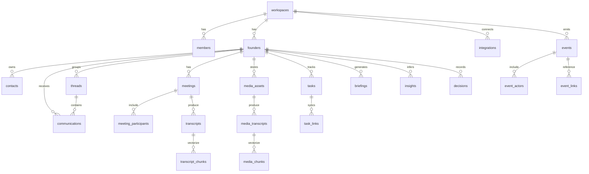

# 1) High-level ERD (Mermaid)



---

# 2) Postgres / Supabase SQL DDL (with pgvector)

> Assumes `pgvector` installed and default embedding size 1536. Adjust as needed (e.g., 3072).

```sql
-- ========================
-- Extensions & Schemas
-- ========================
CREATE EXTENSION IF NOT EXISTS vector;

CREATE SCHEMA IF NOT EXISTS core;
CREATE SCHEMA IF NOT EXISTS ops;
CREATE SCHEMA IF NOT EXISTS comms;
CREATE SCHEMA IF NOT EXISTS meetings;
CREATE SCHEMA IF NOT EXISTS media;
CREATE SCHEMA IF NOT EXISTS work;
CREATE SCHEMA IF NOT EXISTS intel;  -- insights/briefings/decisions

-- ========================
-- Enums
-- ========================
DO $$ BEGIN
  CREATE TYPE core.role_type          AS ENUM ('owner','admin','member','viewer','service');
  CREATE TYPE core.integration_status AS ENUM ('connected','error','revoked','pending');
  CREATE TYPE core.connection_type    AS ENUM ('mcp','api');
  CREATE TYPE core.platform_enum      AS ENUM (
    'gmail','outlook','slack','discord','zoom','loom','fireflies','otter','monday','notion','granola','zerodb','zerovoice'
  );
  CREATE TYPE core.priority_enum      AS ENUM ('urgent','high','normal','low');
  CREATE TYPE comms.source_enum       AS ENUM ('email','slack','discord','system');
  CREATE TYPE work.task_status_enum   AS ENUM ('todo','in_progress','blocked','done','canceled');
  CREATE TYPE intel.insight_type_enum AS ENUM ('kpi','decision_hint','recommendation','risk','anomaly');
EXCEPTION WHEN duplicate_object THEN NULL; END $$;

-- ========================
-- Multi-tenant core
-- ========================
CREATE TABLE core.workspaces (
  id            uuid PRIMARY KEY DEFAULT gen_random_uuid(),
  name          text NOT NULL,
  created_at    timestamptz NOT NULL DEFAULT now()
);

CREATE TABLE core.members (
  id            uuid PRIMARY KEY DEFAULT gen_random_uuid(),
  workspace_id  uuid NOT NULL REFERENCES core.workspaces(id) ON DELETE CASCADE,
  user_id       uuid NOT NULL,              -- Supabase auth.user id
  role          core.role_type NOT NULL DEFAULT 'member',
  created_at    timestamptz NOT NULL DEFAULT now(),
  UNIQUE (workspace_id, user_id)
);

CREATE TABLE core.founders (
  id            uuid PRIMARY KEY DEFAULT gen_random_uuid(),
  workspace_id  uuid NOT NULL REFERENCES core.workspaces(id) ON DELETE CASCADE,
  user_id       uuid NOT NULL,              -- maps to the founder’s auth user
  display_name  text,
  email         text,
  preferences   jsonb NOT NULL DEFAULT '{}'::jsonb,
  created_at    timestamptz NOT NULL DEFAULT now(),
  UNIQUE (workspace_id, user_id)
);

-- ========================
-- Integrations (MCP-first)
-- ========================
CREATE TABLE core.integrations (
  id              uuid PRIMARY KEY DEFAULT gen_random_uuid(),
  workspace_id    uuid NOT NULL REFERENCES core.workspaces(id) ON DELETE CASCADE,
  founder_id      uuid REFERENCES core.founders(id) ON DELETE SET NULL,
  platform        core.platform_enum NOT NULL,
  connection_type core.connection_type NOT NULL DEFAULT 'mcp',
  status          core.integration_status NOT NULL DEFAULT 'pending',
  credentials_enc bytea,                -- encrypted token blob (KMS/Envelope)
  metadata        jsonb NOT NULL DEFAULT '{}'::jsonb,
  connected_at    timestamptz,
  updated_at      timestamptz NOT NULL DEFAULT now(),
  UNIQUE (workspace_id, founder_id, platform)
);

CREATE INDEX ON core.integrations (workspace_id, platform);

-- ========================
-- Contacts (investors, advisors, etc.)
-- ========================
CREATE TABLE core.contacts (
  id            uuid PRIMARY KEY DEFAULT gen_random_uuid(),
  workspace_id  uuid NOT NULL REFERENCES core.workspaces(id) ON DELETE CASCADE,
  founder_id    uuid NOT NULL REFERENCES core.founders(id) ON DELETE CASCADE,
  name          text NOT NULL,
  type          text,               -- 'investor','advisor','team','partner'
  company       text,
  email         text,
  phone         text,
  context       jsonb NOT NULL DEFAULT '{}'::jsonb,        -- freeform notes
  embedding     vector(1536),                              -- semantic memory
  last_contacted timestamptz,
  created_at    timestamptz NOT NULL DEFAULT now()
);

CREATE INDEX contacts_embedding_idx ON core.contacts USING ivfflat (embedding vector_cosine_ops) WITH (lists=100);
CREATE INDEX ON core.contacts (workspace_id, founder_id, type);

-- ========================
-- Communications (Email/Slack/Discord) + Threads
-- ========================
CREATE TABLE comms.threads (
  id            uuid PRIMARY KEY DEFAULT gen_random_uuid(),
  workspace_id  uuid NOT NULL REFERENCES core.workspaces(id) ON DELETE CASCADE,
  founder_id    uuid NOT NULL REFERENCES core.founders(id) ON DELETE CASCADE,
  platform      core.platform_enum NOT NULL,              -- gmail/outlook/slack/discord
  external_id   text,                                     -- thread/conversation id
  subject       text,
  created_at    timestamptz NOT NULL DEFAULT now(),
  UNIQUE (workspace_id, platform, external_id)
);

CREATE TABLE comms.communications (
  id             uuid PRIMARY KEY DEFAULT gen_random_uuid(),
  workspace_id   uuid NOT NULL REFERENCES core.workspaces(id) ON DELETE CASCADE,
  founder_id     uuid NOT NULL REFERENCES core.founders(id) ON DELETE CASCADE,
  thread_id      uuid REFERENCES comms.threads(id) ON DELETE SET NULL,
  platform       core.platform_enum NOT NULL,
  source         comms.source_enum NOT NULL,             -- email/slack/discord/system
  sender         text,
  recipients     text[],
  subject        text,
  content        text,
  snippet        text,
  sentiment      jsonb,                                   -- score, label
  urgency        core.priority_enum,
  followup_needed boolean NOT NULL DEFAULT false,
  received_at    timestamptz,
  embedding      vector(1536),
  raw            jsonb,                                   -- full raw payload if needed
  created_at     timestamptz NOT NULL DEFAULT now()
);

CREATE INDEX comms_comm_embedding_idx ON comms.communications USING ivfflat (embedding vector_cosine_ops) WITH (lists=100);
CREATE INDEX ON comms.communications (workspace_id, founder_id, platform, received_at DESC);
CREATE INDEX ON comms.communications (followup_needed) WHERE followup_needed = true;

-- ========================
-- Meetings (Zoom/Outlook/Google) + Transcripts (Zoom, Fireflies, Otter)
-- ========================
CREATE TABLE meetings.meetings (
  id            uuid PRIMARY KEY DEFAULT gen_random_uuid(),
  workspace_id  uuid NOT NULL REFERENCES core.workspaces(id) ON DELETE CASCADE,
  founder_id    uuid NOT NULL REFERENCES core.founders(id) ON DELETE CASCADE,
  platform      core.platform_enum NOT NULL,      -- 'zoom','outlook'
  external_id   text,                             -- meeting/recording id
  title         text,
  agenda        text,
  start_time    timestamptz,
  end_time      timestamptz,
  location_url  text,                             -- zoom link, etc.
  summary       text,
  action_items  jsonb NOT NULL DEFAULT '[]'::jsonb,
  created_at    timestamptz NOT NULL DEFAULT now(),
  UNIQUE (workspace_id, platform, external_id)
);

CREATE TABLE meetings.meeting_participants (
  id            uuid PRIMARY KEY DEFAULT gen_random_uuid(),
  meeting_id    uuid NOT NULL REFERENCES meetings.meetings(id) ON DELETE CASCADE,
  name          text,
  email         text,
  role          text,       -- 'host','guest','speaker'
  joined_at     timestamptz,
  left_at       timestamptz
);

CREATE TABLE meetings.transcripts (
  id            uuid PRIMARY KEY DEFAULT gen_random_uuid(),
  workspace_id  uuid NOT NULL REFERENCES core.workspaces(id) ON DELETE CASCADE,
  founder_id    uuid NOT NULL REFERENCES core.founders(id) ON DELETE CASCADE,
  meeting_id    uuid REFERENCES meetings.meetings(id) ON DELETE CASCADE,
  provider      core.platform_enum NOT NULL,              -- 'zoom','fireflies','otter'
  title         text,
  url           text,
  language      text DEFAULT 'en',
  summary       jsonb NOT NULL DEFAULT '{}'::jsonb,       -- bullets, tl;dr
  action_items  jsonb NOT NULL DEFAULT '[]'::jsonb,
  recorded_at   timestamptz,
  created_at    timestamptz NOT NULL DEFAULT now()
);

CREATE TABLE meetings.transcript_chunks (
  id            uuid PRIMARY KEY DEFAULT gen_random_uuid(),
  transcript_id uuid NOT NULL REFERENCES meetings.transcripts(id) ON DELETE CASCADE,
  start_sec     int,
  end_sec       int,
  speaker       text,
  text          text,
  embedding     vector(1536)
);

CREATE INDEX mtc_embedding_idx ON meetings.transcript_chunks USING ivfflat (embedding vector_cosine_ops) WITH (lists=200);
CREATE INDEX ON meetings.transcript_chunks (transcript_id);

-- ========================
-- Media (Loom) + Derivative transcripts
-- ========================
CREATE TABLE media.media_assets (
  id            uuid PRIMARY KEY DEFAULT gen_random_uuid(),
  workspace_id  uuid NOT NULL REFERENCES core.workspaces(id) ON DELETE CASCADE,
  founder_id    uuid NOT NULL REFERENCES core.founders(id) ON DELETE CASCADE,
  platform      core.platform_enum NOT NULL,          -- 'loom'
  external_id   text,                                 -- loom video id
  title         text,
  url           text,
  recorded_at   timestamptz,
  metadata      jsonb NOT NULL DEFAULT '{}'::jsonb,
  created_at    timestamptz NOT NULL DEFAULT now(),
  UNIQUE (workspace_id, platform, external_id)
);

CREATE TABLE media.media_transcripts (
  id            uuid PRIMARY KEY DEFAULT gen_random_uuid(),
  media_id      uuid NOT NULL REFERENCES media.media_assets(id) ON DELETE CASCADE,
  provider      core.platform_enum NOT NULL,          -- 'loom','otter','fireflies'
  language      text DEFAULT 'en',
  summary       jsonb NOT NULL DEFAULT '{}'::jsonb,
  action_items  jsonb NOT NULL DEFAULT '[]'::jsonb,
  created_at    timestamptz NOT NULL DEFAULT now()
);

CREATE TABLE media.media_chunks (
  id            uuid PRIMARY KEY DEFAULT gen_random_uuid(),
  media_transcript_id uuid NOT NULL REFERENCES media.media_transcripts(id) ON DELETE CASCADE,
  start_sec     int,
  end_sec       int,
  speaker       text,
  text          text,
  embedding     vector(1536)
);

CREATE INDEX mmc_embedding_idx ON media.media_chunks USING ivfflat (embedding vector_cosine_ops) WITH (lists=200);

-- ========================
-- Tasks (Monday/Notion) + Links to external systems
-- ========================
CREATE TABLE work.tasks (
  id            uuid PRIMARY KEY DEFAULT gen_random_uuid(),
  workspace_id  uuid NOT NULL REFERENCES core.workspaces(id) ON DELETE CASCADE,
  founder_id    uuid NOT NULL REFERENCES core.founders(id) ON DELETE CASCADE,
  title         text NOT NULL,
  description   text,
  platform      core.platform_enum,                  -- 'monday','notion'
  priority      core.priority_enum DEFAULT 'normal',
  status        work.task_status_enum NOT NULL DEFAULT 'todo',
  due_date      timestamptz,
  source_ref    jsonb,                               -- origin: meeting_id, comm_id, media_id
  created_at    timestamptz NOT NULL DEFAULT now(),
  updated_at    timestamptz NOT NULL DEFAULT now()
);

CREATE TABLE work.task_links (
  id            uuid PRIMARY KEY DEFAULT gen_random_uuid(),
  task_id       uuid NOT NULL REFERENCES work.tasks(id) ON DELETE CASCADE,
  platform      core.platform_enum NOT NULL,
  external_id   text NOT NULL,                       -- monday item id, notion page id
  url           text,
  metadata      jsonb NOT NULL DEFAULT '{}'::jsonb,
  UNIQUE (platform, external_id)
);

-- ========================
-- Briefings, Insights, Decisions
-- ========================
CREATE TABLE intel.briefings (
  id            uuid PRIMARY KEY DEFAULT gen_random_uuid(),
  workspace_id  uuid NOT NULL REFERENCES core.workspaces(id) ON DELETE CASCADE,
  founder_id    uuid NOT NULL REFERENCES core.founders(id) ON DELETE CASCADE,
  kind          text NOT NULL,        -- 'morning','evening','custom'
  summary       text,
  insights      jsonb NOT NULL DEFAULT '[]'::jsonb,  -- inline insights
  created_at    timestamptz NOT NULL DEFAULT now()
);

CREATE TABLE intel.insights (
  id            uuid PRIMARY KEY DEFAULT gen_random_uuid(),
  workspace_id  uuid NOT NULL REFERENCES core.workspaces(id) ON DELETE CASCADE,
  founder_id    uuid NOT NULL REFERENCES core.founders(id) ON DELETE CASCADE,
  source        core.platform_enum,                  -- 'granola','meetings','loom',...
  insight_type  intel.insight_type_enum NOT NULL,
  content       jsonb NOT NULL,
  confidence    double precision,
  created_at    timestamptz NOT NULL DEFAULT now(),
  embedding     vector(1536)
);

CREATE INDEX insights_embedding_idx ON intel.insights USING ivfflat (embedding vector_cosine_ops) WITH (lists=100);

CREATE TABLE intel.decisions (
  id            uuid PRIMARY KEY DEFAULT gen_random_uuid(),
  workspace_id  uuid NOT NULL REFERENCES core.workspaces(id) ON DELETE CASCADE,
  founder_id    uuid NOT NULL REFERENCES core.founders(id) ON DELETE CASCADE,
  context       text,
  recommendation text,
  confidence    double precision,
  taken         boolean NOT NULL DEFAULT false,
  taken_at      timestamptz,
  created_at    timestamptz NOT NULL DEFAULT now()
);

-- ========================
-- Event Sourcing & Audit
-- ========================
CREATE TABLE ops.events (
  id            uuid PRIMARY KEY DEFAULT gen_random_uuid(),
  workspace_id  uuid NOT NULL REFERENCES core.workspaces(id) ON DELETE CASCADE,
  actor_type    text NOT NULL,                     -- 'agent','user','system'
  actor_id      uuid,                              -- member id OR agent id
  event_type    text NOT NULL,                     -- 'ingest','summarize','route_task','send_email', ...
  payload       jsonb NOT NULL,                    -- exact inputs/outputs
  linked_entity text,                              -- 'communication','meeting','task','insight','briefing'
  linked_id     uuid,                              -- fk-like (no direct constraint to stay flexible)
  created_at    timestamptz NOT NULL DEFAULT now()
);

CREATE INDEX ON ops.events (workspace_id, event_type, created_at DESC);

CREATE TABLE ops.event_actors (
  id         uuid PRIMARY KEY DEFAULT gen_random_uuid(),
  event_id   uuid NOT NULL REFERENCES ops.events(id) ON DELETE CASCADE,
  role       text NOT NULL,                         -- 'origin','on_behalf','target'
  ref_table  text NOT NULL,                         -- 'core.members','core.contacts', etc.
  ref_id     uuid NOT NULL
);

CREATE TABLE ops.event_links (
  id           uuid PRIMARY KEY DEFAULT gen_random_uuid(),
  event_id     uuid NOT NULL REFERENCES ops.events(id) ON DELETE CASCADE,
  link_type    text NOT NULL,                       -- 'caused','derived_from','references'
  ref_table    text NOT NULL,                       -- 'comms.communications','meetings.meetings',...
  ref_id       uuid NOT NULL
);
```

---

# 3) Derived Views & Materialized Views

```sql
-- Urgent inbox across channels
CREATE VIEW comms.v_pending_followups AS
SELECT c.*
FROM comms.communications c
WHERE c.followup_needed = true
ORDER BY c.received_at DESC;

-- Tasks due soon (72h)
CREATE VIEW work.v_tasks_due_soon AS
SELECT t.*
FROM work.tasks t
WHERE t.status IN ('todo','in_progress')
  AND t.due_date IS NOT NULL
  AND t.due_date <= now() + interval '72 hours'
ORDER BY t.due_date ASC;

-- Daily Brief source view (meetings + KPIs + top unread)
-- NOTE: Plug your Granola MCP fetch into application layer, but this view helps stage SQL parts.
CREATE MATERIALIZED VIEW intel.mv_daily_brief_sources AS
WITH top_unread AS (
  SELECT workspace_id, founder_id, id, platform, subject, snippet, received_at
  FROM comms.communications
  WHERE followup_needed IS TRUE
  ORDER BY received_at DESC
  LIMIT 50
),
upcoming_meetings AS (
  SELECT workspace_id, founder_id, id, title, start_time, location_url
  FROM meetings.meetings
  WHERE start_time >= now() AND start_time <= now() + interval '24 hours'
)
SELECT 'unread' AS section, to_jsonb(top_unread.*) AS item
FROM top_unread
UNION ALL
SELECT 'meetings' AS section, to_jsonb(upcoming_meetings.*) AS item
FROM upcoming_meetings;

-- Recommended vector index maintenance (run after bulk loads)
-- REFRESH MATERIALIZED VIEW CONCURRENTLY intel.mv_daily_brief_sources;
```

---

# 4) RLS (Supabase) Sketch

> Enforce row-level isolation by `workspace_id`. Pseudocode policies:

* For every table with `workspace_id`, **enable RLS**.
* **Policy: members can SELECT rows where `workspace_id` IN (SELECT workspace_id FROM core.members WHERE user_id = auth.uid())**.
* **INSERT/UPDATE/DELETE** allowed if user is in members with role in (`owner`,`admin`) or owns the `founder_id` row, depending on entity.

Example pattern:

```sql
ALTER TABLE core.founders ENABLE ROW LEVEL SECURITY;

CREATE POLICY founders_sel
ON core.founders
FOR SELECT
USING (workspace_id IN (SELECT workspace_id FROM core.members WHERE user_id = auth.uid()));

CREATE POLICY founders_mod
ON core.founders
FOR INSERT WITH CHECK (workspace_id IN (SELECT workspace_id FROM core.members WHERE user_id = auth.uid()))
TO authenticated;

-- Repeat similarly for all workspace-scoped tables.
```

---

# 5) MCP Mapping Notes (how agents plug into this model)

* **Zoom MCP**

  * `meetings.meetings` ← Meeting metadata
  * `meetings.transcripts` (provider='zoom') + `meetings.transcript_chunks` with embeddings
* **Fireflies / Otter MCP**

  * Write alternate transcripts: `meetings.transcripts` (provider='fireflies'|'otter'), link to same `meeting_id`
* **Loom MCP**

  * `media.media_assets` (video), then `media.media_transcripts` + `media.media_chunks`
* **Slack/Discord MCP**

  * Threads → `comms.threads` (platform='slack'|'discord')
  * Messages → `comms.communications` (source='slack'|'discord'), set `followup_needed` via classifier
* **Gmail/Outlook MCP**

  * Threads + messages → `comms.threads` / `comms.communications` (source='email', platform='gmail'|'outlook')
* **Monday MCP**

  * Create tasks in `work.tasks`, persist remote references in `work.task_links`
* **Notion MCP**

  * Attach docs: store Notion page IDs in `work.task_links` (platform='notion') or in `metadata` of related records
* **Granola MCP**

  * KPIs → `intel.insights` (source='granola', insight_type='kpi') and embed vectors for semantic recall
* **ZeroDB MCP**

  * Optional: keep embeddings in ZeroDB too; this schema already stores them locally for fast joins

---

## Optional: Helpful Composite Indexes

```sql
-- Fast “today’s brief” lookups
CREATE INDEX ON intel.briefings (workspace_id, founder_id, created_at DESC);

-- Meeting window queries
CREATE INDEX ON meetings.meetings (workspace_id, founder_id, start_time);

-- Task triage
CREATE INDEX ON work.tasks (workspace_id, founder_id, status, priority, due_date);
```

---

## Example: Minimal Insert Flow (Meeting → Actions)

1. Zoom MCP upserts `meetings.meetings` + recording/ids
2. Fireflies MCP inserts `meetings.transcripts` and bulk `meetings.transcript_chunks` (with embeddings)
3. Summarizer agent writes `summary`/`action_items` into `meetings.transcripts`
4. Router agent creates `work.tasks` and `work.task_links` (platform='monday')
5. Event trail logged into `ops.events` with `event_links` to meeting, transcript, tasks

---


